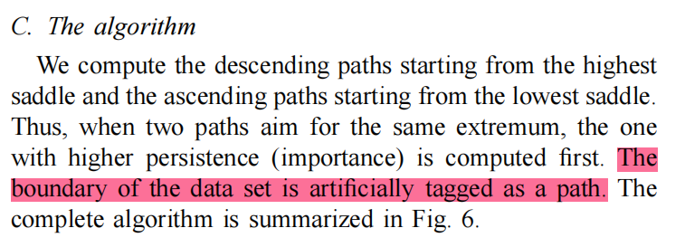

### We can see a MSC region on this pic.

### Monkey saddle:

1. 增加sample(没有理论依据)
2. follow 两种paper的split
### 边界上的criticals: ackley函数情况下，找到了一些问题
1. 边界上的极小值点: 存在一些边界极小值点是**误判**, 因为其梯度的长度很大，且方向指向inner area，这说明实际的极小值点在实验所设置的定义域外部

1. 边界上的极大值点：同样可能是**误判**，但在本例中，右下角边界的极大值点非常接近正确的极大值点

1. 边界上的鞍点：如果梯度很大 说明 鞍点就是错的，但不知道其具体方位

边界上的criticals，不管他的gradient大不大，也没关系
也可以加一个扰动，加了以后，他就不是criticals了

generic function: 给原本函数加一个epsilon

genericity

### 模块化：
1. standalone模型 (模型，定义域) 【二维函数】
2. samples生成
3. criticals的检测
   1. 遍历每个点，用lower link以及upper link的connected component数目判断
4. criticals的优化
   1. 优化前提：在二维情况下，**仅存在极大值点，极小值点以及1 fold-saddle (普通鞍点)**, 这些点我们统称为**普通criticals**, 这要求我们先处理2-fold saddle (monkey saddle), 要将monkey saddle先处理成两个普通鞍点，完成这一步后，进入下一步
   2. 优化目标：让所有**普通criticals**接近真实的criticals (gradient的长度接近0)
5. integral lines的提取（构建MSC必不可少的Ascending manifold和descending manifold）
   1. 目前的操作是根据Edelsbrunner针对PL函数的方法进行的，integral lines是沿着网格的**边**行进的
   2. Timo论文中的integral lines并非沿着边，而实沿着实际的**正梯度**方向行进的
6. integral line的优化
   1. 同类lines的merge (允许，**但是尽可能让junction point接近critical**)、不同类型lines的intersect (这个不允许)，在timo paper中讲到具体方法 (沿着真实梯度方向，动态地创建三角边去避免不同类型integral line的相交)

### Others
descending manifold: 点和周围下降的部分

ascending manifold: 点和周围上升的部分

关于边界处理的另外一个想法：
* 直接线性地，按照原本的斜率，去扩展边界，然后，我们不处理扩展出来的部分，仅处理原本的部分，这样做可以让原本边界上的criticals全部变成regular points, 然后在trace stream line的时候，如果到了边界上的点，就不要再trace了

2024/07/06 9.30 p.m. 星期五 讨论：
* 2D 情况下 field value colormap
* 目前最重要的：优化调整critical points，**其中最需要做的就是monkey saddle的分裂** 【目前可行】
* monkey saddle: locally 增加一些sample，目前尝试全部重新triangulation / Edelsbrunner (或 Timo) 的处理方法
* junction point: 在连续情况下 junction point只会出现在critical points, 希望junction point尽可能接近critical
  point (比如 用户给定一个epsilon) / 用Timo的方法
* trace numerical line出现了十分奇怪的结果：原因可能是 模型训练没训练好, step size, ode int 【目前可行】
* 对于**普通criticals**, 也可以尝试用one-neighbour来细化 --> 从而实现对critical的优化，比如maximun，他有一个one-star，然后找one-star里面每一个三角形的质心，看maximum往哪边移动，在那个新到达的star中接着 refine
* 关于我采的二维点(x, y)样本是否需要增加边界的问题：不用shift了，待测试 【目前可行】

我当前做了哪些？
* 增加了monkey saddle的判断
* 添加了一个测试函数，类似于timo论文中的volcano
* 增加了underlying gradient field的可视化
* 增加了field value的colormap，从而可直观的看出discrete integral line对不对，即红线应当为ascending，蓝线应当为descending
* 知道了什么是MSC region，看了下timo论文

**整理一下思绪**
* 我目前所作的是**基础部分**，后面research应该是类似timo论文中的hierarchy部分
* 基础部分 --> 构建INR的MSC，首要任务
* MSC = Ascending 交 Descending

出现了什么问题？
1. 离散条件下，边界上的criticals的问题：如果边界上的critical是实际的critical，那么一定会有integral line以他作为终点
2. Integral line的merge问题，以及相交问题

我有哪些思考？
**目前先解决monkey saddle的问题**

Morse function:
所有criticals都是non-degenerate的，他的H都是可逆的

SoS的idea：

点和polygon的关系：射线测试

点和polygon的关系可转化为行列式判断符号问题（齐次坐标下）
**SoS 非常重要** 深入浅出的讲解

有一堆一维的点，如何稳定的判断点之间的大小关系
判断不出来，我加一个symbolic 扰动

任意一个函数可以加一些扰动 -> morse函数

需要设计一个robust的扰动，让任意函数能成为morse函数，没有改变任何函数的值，仅仅是改变了点之间大小判断规则

对于monkey saddle: 他分裂后，应该还是同一个点

1. 给定一个PL function，根据Timo/.. 得到MSC，确保方法实现正确【尝试用sinx + siny这个函数，去实现一个Timo方法，测试正确性】，用一个analytical function来测试我当前的方法对不对，也可以做一些比较 INR是怎样，analytical怎样
2. refine criticals, update local mesh, gradient of function |grad f|^2
3. refine integral lines: 之前通过regular points front/back trace lines 比较，更新discrete lines
4. global refinement: 对于bad 三角形的refinement，整个三角化的refine

最好是locally triangulation, 更新不能对当前已有结果造成很大影响
2.3.的design很重要
topological simplification

移动max，可以是增加新点，原本的点不动

找一个对于INR的一个PL approximation